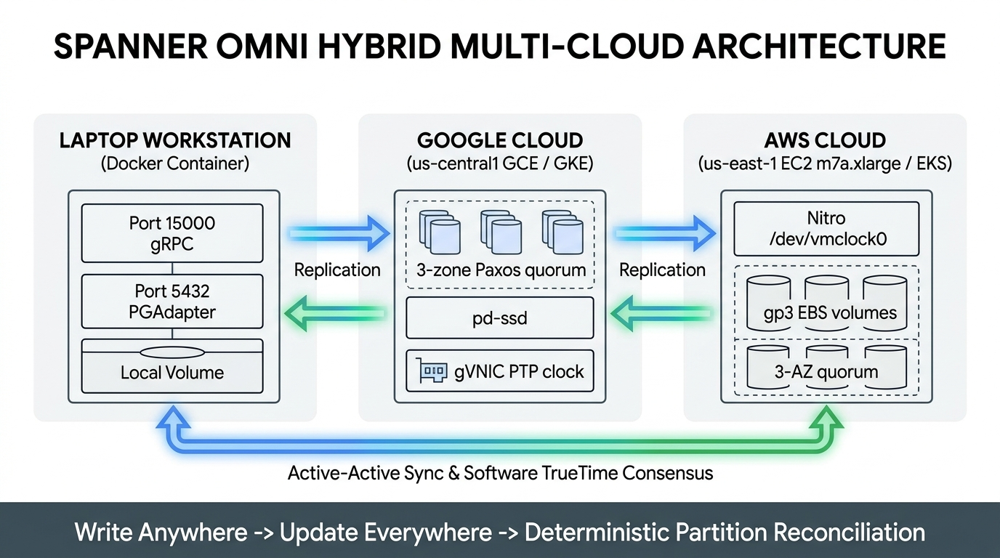

# Spanner Omni Hybrid Multi-Cloud Showcase (Laptop Docker • GCP • AWS)



A complete, hands-on reference implementation showcasing **Google Cloud Spanner Omni (GA `2026.r4-lts`)** running across three distinct environments:

1. **Laptop Workstation (`127.0.0.1:15000`)** — Single-server Spanner Omni Docker container with persistent volume storage.
2. **Google Cloud (`127.0.0.1:25000` via SSH Tunnel)** — Self-managed Spanner Omni on Compute Engine (`e2-standard-4`, `pd-ssd`, `TERMINATE` maintenance policy) and 3-zone regional GKE (`k8s/regional-gke.yaml`).
3. **Amazon Web Services (`127.0.0.1:35000` via SSH Tunnel)** — Self-managed Spanner Omni on AWS EC2 (`m7a.xlarge` with Amazon Linux 2023, encrypted `gp3` EBS, and hardware PTP clock `/dev/vmclock0`) and 3-zone regional EKS (`k8s/regional-eks.yaml`).

---

## What This Project Demonstrates

1. **Write Anywhere, Update Everywhere (Cross-Environment Active-Active Replication)**:
   - Update an account balance (`PayMesh`) or purchase retail inventory (`OmniRetail`) in **any** environment (`laptop`, `gcp`, or `aws`) and observe real-time propagation across all connected peer environments.
2. **Network Disruption & TrueTime Partition Reconciliation (`Recon`)**:
   - Sever any network link (`laptop <-> gcp`, `gcp <-> aws`, `laptop <-> aws`) or isolate an environment completely via the interactive Control Plane UI or CLI.
   - Continue executing transactions locally on disconnected environments while mutations accumulate atomically in the `SyncMutations` transactional outbox.
   - Heal the network and run the **TrueTime Anti-Entropy Reconciliation Engine** (`recon_engine.py`):
     - **Commutative Delta Merging**: Concurrent account transfers on different partitions merge without losing updates.
     - **Split-Brain Inventory Compensation**: Concurrent orders that exceed available stock across disconnected partitions are ordered by Software TrueTime (`CommitTs`); earlier commits win physical stock while later conflicting orders are deterministically compensated (`BACKORDERED_RECON_COMPENSATED`) to preserve `CONSTRAINT StockNonnegative CHECK (Stock >= 0)`.
     - **Cryptographic Convergence Verification**: Verifies that all three environments converge on the exact same `SHA-256` state digest.
3. **Unified Multi-Model Engine in One Database (`schema.sql`)**:
   - **Relational & Interleaved Tables**: `Customers` parent table with physically co-located `Orders` (`INTERLEAVE IN PARENT Customers ON DELETE CASCADE`) and `Accounts` / `Transfers`.
   - **Full-Text Search**: Automatic `TOKENIZE_FULLTEXT` and `SEARCH` indexes over `Accounts` and `Products`.
   - **Vector Similarity Search**: `COSINE_DISTANCE` KNN recommendations filtered by live transactional inventory (`Stock > 0`).
   - **ISO GQL Property Graphs**: `PayGraph` (1-to-3 hop payment reachability) and `RetailGraph` (`(c:Customer)-[o:Purchased]->(p:Product)`).

---

## Repository Structure

```text
spanner-omni-hybrid-showcase/
├── README.md                          # Project overview & quickstart guide
├── schema.sql                         # GoogleSQL DDL: Interleaved tables, Search, Vectors, Graphs & Outbox
├── db.py                              # Spanner Omni multi-endpoint client & transactional engine
├── recon_engine.py                    # Cross-cloud replication & TrueTime partition reconciliation engine
├── app.py                             # FastAPI Multi-Cloud Control Plane & REST API
├── manage.py                          # CLI for init, invariant verification, and guided recon simulation
├── init_db.py                         # Standalone schema & seed initializer
├── static/
│   └── index.html                     # Interactive 3-Environment Control Plane Web UI
├── env/
│   ├── laptop.env                     # Laptop Docker profile (127.0.0.1:15000)
│   ├── gcp.env                        # GCP Compute Engine tunnel profile (127.0.0.1:25000)
│   ├── aws.env                        # AWS EC2 M7a tunnel profile (127.0.0.1:35000)
│   └── mesh.env                       # Unified 3-environment mesh profile
├── scripts/
│   ├── laptop-start.sh                # Pull & launch Spanner Omni 2026.r4-lts in Docker
│   ├── gcp-create.sh                  # Provision GCP VPC, firewall, pd-ssd, and GCE VM
│   ├── aws-create.sh                  # Provision AWS SG, gp3 EBS, and m7a.xlarge AL2023 VM (/dev/vmclock0)
│   ├── start-tunnels.sh               # SSH port-forwarding helper for GCP (25000) and AWS (35000)
│   ├── start-app.sh                   # Launch the FastAPI Control Plane web server
│   └── cleanup.sh                     # Safe teardown of Laptop, GCP, and AWS lab resources
├── k8s/
│   ├── regional-gke.yaml              # 3-zone GKE Helm values (Chart 1.0.0)
│   ├── regional-eks.yaml              # 3-zone EKS Helm values with /dev/vmclock0
│   ├── values-multi-cloud.yaml        # Cross-cloud GKE + EKS Helm values for single distributed database
│   └── spanner-multi-cloud.yaml       # Multi-cloud Paxos quorum server topology
├── tests/
│   ├── test_recon_and_sync.py         # Automated unit & integration test suite
│   └── race.py                        # 12-worker concurrent checkout & idempotency verification test
└── blog/
    ├── medium_blog_spanner_omni_hybrid.md  # Accompanying Medium blog post
    └── images/                             # Nano Banana architectural illustrations
```

---

## Quickstart

### 1. Run the Guided Cross-Cloud Sync & Network Partition Reconciliation Demo (CLI)
You can immediately run the 3-phase replication, network disruption, and TrueTime reconciliation simulation:

```bash
python3 manage.py simulate-recon
python3 manage.py verify
```

### 2. Run the Automated Test Suite
```bash
python3 -m unittest discover -s tests -p "test_*.py" -v
```

### 3. Launch the Interactive 3-Environment Control Plane Web UI
```bash
python3 -m venv .venv
source .venv/bin/activate
python -m pip install -r requirements.txt
bash scripts/start-app.sh
```
Open **`http://127.0.0.1:8080`** in your browser to interact with **Laptop**, **GCP**, and **AWS** side by side, toggle network links up/down, trigger transactions, and inspect the live `ReconciliationEvents` audit log.

### 4. Deploy Live Spanner Omni Containers across Laptop, GCP, and AWS
```bash
# 1. Start Spanner Omni GA container on your laptop (127.0.0.1:15000)
bash scripts/laptop-start.sh
source env/laptop.env && python3 manage.py init

# 2. Provision GCP Compute Engine VM & forward 127.0.0.1:25000 -> 15000
export GCP_PROJECT=your-gcp-project
export GCP_ZONE=us-central1-a
export MY_IP_CIDR=$(curl -s https://checkip.amazonaws.com)/32
bash scripts/gcp-create.sh

# 3. Provision AWS EC2 m7a.xlarge VM (/dev/vmclock0) & forward 127.0.0.1:35000 -> 15000
export AWS_REGION=us-east-1
export AWS_SUBNET_ID=subnet-xxxxxxxx
export AWS_KEY_NAME=your-ec2-keypair
bash scripts/aws-create.sh
```

---

## Accompanying Medium Blog

Read the full technical deep dive in [`blog/medium_blog_spanner_omni_hybrid.md`](./blog/medium_blog_spanner_omni_hybrid.md):
- [Spanner Omni Everywhere: Building a Hybrid Multi-Cloud Database Mesh Across GCP, AWS, and Laptop Docker — With Live Replication & TrueTime Partition Reconciliation](./blog/medium_blog_spanner_omni_hybrid.md)
