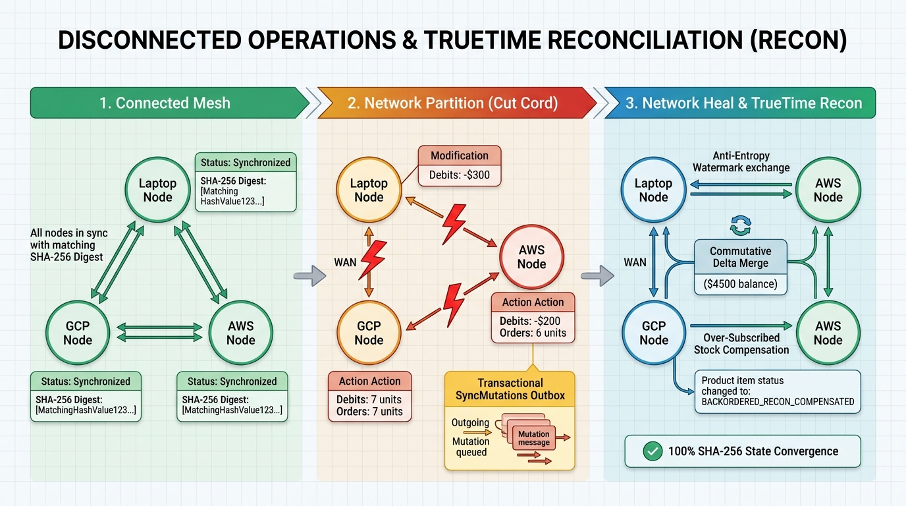

# Spanner Omni Hybrid Multi-Cloud Showcase (Laptop Docker • GCP • AWS)

> [!IMPORTANT]
> **Personal Project Disclaimer**: This repository is a **personal project** created for architectural exploration, hands-on multi-cloud testing, and technical education. It is **not** an official Google Cloud product, nor is it an officially supported Google reference implementation. Product features, CLI flags, SDK versions, and licensing terms evolve rapidly—always consult the **[Official Google Cloud Spanner Omni Documentation](https://docs.cloud.google.com/spanner-omni/overview)** and **[Spanner Omni Release Notes](https://docs.cloud.google.com/spanner-omni/release-notes)** for authoritative and up-to-date information.


---

## Table of Contents

1. [Overview & Architectural Goals](#1-overview--architectural-goals)
2. [Spanner Omni Editions & Licensing Deep Dive (Developer vs. Commercial vs. Managed)](#2-spanner-omni-editions--licensing-deep-dive-developer-vs-commercial-vs-managed)
3. [Prerequisites to Create All Three Environments (Laptop, GCP, AWS)](#3-prerequisites-to-create-all-three-environments-laptop-gcp-aws)
4. [Repository Structure (100% Self-Contained)](#4-repository-structure-100-self-contained)
5. [Step-by-Step Deployment Guide Across All Three Environments](#5-step-by-step-deployment-guide-across-all-three-environments)
6. [Testing Cross-Environment Sync & Network Disruption Reconciliation (`Recon`)](#6-testing-cross-environment-sync--network-disruption-reconciliation-recon)
7. [Running the Self-Contained Sample Application (`sample-app/`)](#7-running-the-self-contained-sample-application-sample-app)
8. [Extending to Kubernetes (GKE, EKS & Single Multi-Cloud Paxos Database)](#8-extending-to-kubernetes-gke-eks--single-multi-cloud-paxos-database)
9. [Troubleshooting & Safe Teardown](#9-troubleshooting--safe-teardown)
10. [Accompanying Medium Blog & Official References](#10-accompanying-medium-blog--official-references)

---

## 1. Overview & Architectural Goals

With the General Availability of **Google Cloud Spanner Omni (`2026.r4-lts`)**, Google has decoupled the Spanner database engine from Google’s proprietary datacenter atomic clocks and GPS receivers by introducing **Software-Based TrueTime ($\epsilon$-drift bounding)**.

This self-contained project demonstrates Spanner Omni running across **three distinct environments**:

| Environment | Target Infrastructure | Local / Tunnel Endpoint | App Port | TrueTime Clock Mechanism |
| :--- | :--- | :--- | :--- | :--- |
| **1. Laptop (`laptop`)** | Local Docker Container (`spanneromni`) | `127.0.0.1:15000` | `8080` | Container NTP / Host Kernel Clock |
| **2. Google Cloud (`gcp`)** | Compute Engine `e2-standard-4` + `100GB pd-ssd` (or GKE) | `127.0.0.1:25000` *(SSH tunnel)* | `8081` | gVNIC PTP / NTP (`TERMINATE` on maintenance) |
| **3. AWS (`aws`)** | EC2 `m7a.xlarge` AL2023 + `100GB gp3` EBS (or EKS) | `127.0.0.1:35000` *(SSH tunnel)* | `8082` | AWS Nitro Hardware PTP (`/dev/vmclock0`) |

### Core Capabilities Demonstrated

1. **Self-Contained Sample Application ([`sample-app/`](./sample-app)) & Control Plane ([`app.py`](./app.py))**:
   - Combines **PayMesh** (financial accounts, atomic transfers, full-text search, and 3-hop payment reachability graph `PayGraph`) with **OmniRetail** (customers, physically interleaved orders `Customers -> Orders`, inventory check constraints, vector similarity search `COSINE_DISTANCE`, and purchase graph `RetailGraph`).
2. **Write Anywhere, Update Everywhere (Cross-Environment Replication)**:
   - When a payment transfer or retail checkout is committed in **any** environment (`laptop`, `gcp`, or `aws`), the mutation is atomically recorded in `SyncMutations` and replicated in real time to all connected peer environments.
3. **Network Disruption & Deterministic Reconciliation (`Recon`)**:
   - Simulate WAN outages or flight-mode disconnections by severing links (`laptop <-> gcp`, `gcp <-> aws`, `laptop <-> aws`) via the Web UI, REST API, or CLI.
   - Continue writing independently to each disconnected environment while mutations queue in `SyncMutations`.
   - Restore connectivity and execute our **4-Phase TrueTime Anti-Entropy Reconciliation Engine** ([`recon_engine.py`](./recon_engine.py)):
     - **Commutative Delta Merging**: Concurrent financial debits/credits across partitioned sites merge cleanly without Last-Write-Wins (LWW) lost updates.
     - **Split-Brain Stock Compensation**: If concurrent orders across disconnected sites exceed physical stock, TrueTime commit ordering (`CommitTs`) honors the earlier transaction and automatically transitions the later conflicting transaction to `BACKORDERED_RECON_COMPENSATED`, preserving `CONSTRAINT StockNonnegative CHECK (Stock >= 0)`.
     - **Cryptographic State Verification**: Computes canonical `SHA-256` digests across all tables on `laptop`, `gcp`, and `aws` to prove 100% state convergence.

---

## 2. Spanner Omni Editions & Licensing Deep Dive (Developer vs. Commercial vs. Managed)

Before deploying Spanner Omni, it is critical to understand the differences between the **Developer Edition**, the **Commercial Edition**, and **Managed Cloud Spanner**:

| Feature / Dimension | Spanner Omni **Developer Edition** (Default in Image) | Spanner Omni **Commercial Edition** | **Managed Cloud Spanner** (GCP Native) |
| :--- | :--- | :--- | :--- |
| **Intended Use** | Non-production, non-commercial development, local CI/CD, functional PoCs, and demos | Mission-critical production workloads on AWS, Azure, On-Premises, Sovereign GCP, or Edge | Workloads running on Google Cloud desiring zero database ops & Google SLAs |
| **Cost / Licensing Model** | **Free** (included by default in container image; optional free perpetual Developer key) | **Annual per-vCPU subscription** (including worker vCPUs) or **paid 90-day PoC license** | Pay-as-you-go per node / processing unit + storage + network |
| **Single-Server ($\le 4$ vCPUs) Expiration** | **Never expires** (unlimited reads & writes) and **supports Backup & Restore** without a license key | Never expires while subscription is active | N/A (Managed continuous service) |
| **Multi-Server or $> 4$ vCPUs Expiration** | **90-day write limit** by default (after 90 days, writes stop and database becomes **read-only**) | No 90-day write limit; scales out across multi-zone/multi-cloud Paxos quorums | Scales seamlessly to thousands of nodes |
| **Perpetual Developer Key Behavior** | Free key removes the 90-day write limit on larger/multi-server dev clusters, **but disables Backup & Restore** when installed | Full **Backup & Restore** enabled at all cluster sizes (to GCS, S3, or S3-compatible object storage) | Native automated Backups, PITR, and Export/Import |
| **High-Scale ANN Vector Search Workers** | **Not supported** (exact KNN via `COSINE_DISTANCE` works, but stateless worker pods on port `15027` are disabled) | **Supported** (stateless workers build ANN vector indexes on tables $>1\text{M}$ rows up to **1 Billion vectors**) | Supported natively |
| **Core SQL, Search & Graph Engine** | Full GoogleSQL, PostgreSQL (`PGAdapter`), Full-Text Search, and ISO GQL Property Graph | Full GoogleSQL, PostgreSQL (`PGAdapter`), Full-Text Search, and ISO GQL Property Graph | Full GoogleSQL, PostgreSQL, Search, Vector, Graph + BigQuery Data Boost & Geo-Partitioning |
| **TLS / mTLS & Internal RBAC** | Supported (`spanner certificates`, OPAQUE password auth, mTLS, internal database roles) | Supported | Managed Google Cloud IAM & CMEK |

> [!TIP]
> **Why our lab uses 4 vCPUs per single-server node (`--cpus="4"` / `e2-standard-4` / `m7a.xlarge`)**: In the **Developer Edition**, a single server with **4 vCPUs or fewer** never expires and retains full **Backup & Restore** capability without needing to install a separate license key.

---

## 3. Prerequisites to Create All Three Environments (Laptop, GCP, AWS)

You do **not** need to pre-create any VPCs, Subnets, Internet Gateways, Route Tables, Security Groups, Firewall Rules, or SSH Key Pairs in GCP or AWS—our provisioning scripts (`scripts/gcp-create.sh` and `scripts/aws-create.sh`) create all networking, security, and compute resources from scratch and record their IDs in `run/*.env` for one-command teardown (`scripts/cleanup.sh`).

### 3.1 Local Workstation (Laptop) Prerequisites

| Requirement | Minimum / Recommended Specification | Verification Command |
| :--- | :--- | :--- |
| **Operating System** | macOS 14.7+ (Apple Silicon `arm64` or Intel `x86_64`) or Linux (Ubuntu 22.04+ / RHEL 9+) | `uname -s -m` |
| **Docker Runtime** | Docker Engine 24+ or Docker Desktop 4.34+ (allocate **$\ge 4$ CPUs** and **8–16 GB RAM** in Docker settings) | `docker version && docker info \| grep -E "CPUs\|Total Memory"` |
| **Python** | Python 3.11 or 3.12+ with `venv` and `pip` | `python3 --version` |
| **Google Cloud CLI** | `gcloud` SDK installed and authenticated | `gcloud version` |
| **AWS CLI** | AWS CLI v2 installed and authenticated | `aws --version` |
| **System Utilities** | `ssh`, `curl`, `tar`, `git`, `jq` (optional) | `ssh -V && curl --version` |
| **Local TCP Ports Free** | `15000`, `15026`, `5432` (Laptop Omni), `25000` (GCP tunnel), `35000` (AWS tunnel), `8080–8082` (Web UI / Sample App) | `lsof -i :15000 -i :25000 -i :35000 -i :8080` |

### 3.2 Google Cloud (GCP) Prerequisites

1. **Active Billed GCP Project**: A sandbox or development project where you have permissions to create networking and compute resources.
2. **Required IAM Roles** on your active `gcloud` identity:
   - `roles/serviceusage.serviceUsageAdmin` (to enable `compute.googleapis.com`)
   - `roles/compute.networkAdmin` (to create the isolated VPC, subnet, Cloud Router, Cloud NAT, and firewall rules)
   - `roles/compute.instanceAdmin.v1` (to create the `e2-standard-4` VM and `100GB pd-ssd` disk)
   - `roles/compute.securityAdmin` (to manage firewall rules)
   - *(Optional for Backup lab)* `roles/storage.admin` and `roles/iam.serviceAccountAdmin`
3. **Regional Quota (`us-central1`)**: At least **4 E2 vCPUs**, **100 GB SSD Persistent Disk (`pd-ssd`)**, and **1 VPC Network**.
4. **Authenticate & Select Project**:
   ```bash
   gcloud auth login
   gcloud config set project YOUR_GCP_PROJECT_ID
   ```

### 3.3 Amazon Web Services (AWS) Prerequisites

1. **Active AWS Account / Sandbox**: Authenticated via `aws configure sso` / `aws sso login` or IAM access keys.
2. **Required IAM Permissions**:
   - **VPC & Networking**: `ec2:CreateVpc`, `ec2:ModifyVpcAttribute`, `ec2:DeleteVpc`, `ec2:CreateInternetGateway`, `ec2:AttachInternetGateway`, `ec2:DetachInternetGateway`, `ec2:DeleteInternetGateway`, `ec2:CreateSubnet`, `ec2:ModifySubnetAttribute`, `ec2:DeleteSubnet`, `ec2:CreateRouteTable`, `ec2:CreateRoute`, `ec2:AssociateRouteTable`, `ec2:DisassociateRouteTable`, `ec2:DeleteRouteTable`
   - **Security & Keys**: `ec2:CreateSecurityGroup`, `ec2:AuthorizeSecurityGroupIngress`, `ec2:DeleteSecurityGroup`, `ec2:CreateKeyPair`, `ec2:DeleteKeyPair`, `ec2:CreateTags`
   - **Compute & AMI Lookup**: `ec2:RunInstances`, `ec2:Describe*`, `ec2:TerminateInstances`, and `ssm:GetParameter` (used to resolve `/aws/service/ami-amazon-linux-latest/al2023-ami-kernel-default-x86_64`)
3. **Why `m7a.xlarge` + Amazon Linux 2023 Is Required on AWS**:
   - Spanner Omni on AWS requires access to the Nitro hardware PTP clock device **`/dev/vmclock0`** to bound Software TrueTime uncertainty ($\epsilon$). Qualified 4th-gen+ Nitro instances such as **`m7a.xlarge`** running **Amazon Linux 2023** expose `/dev/vmclock0` natively.
4. **Authenticate & Verify Identity**:
   ```bash
   aws sts get-caller-identity
   ```

---

## 4. Repository Structure (100% Self-Contained)

```text
spanner-omni-hybrid-showcase/
├── README.md                          # Comprehensive architectural & operational guide
├── AGENTS.md                          # Instructions & guardrails for AI coding agents
├── schema.sql                         # Canonical GoogleSQL DDL (Interleaved tables, Search, Vectors, Graphs, Outbox)
├── db.py                              # Spanner Omni multi-endpoint connection manager & local replica engine
├── recon_engine.py                    # Cross-environment replication & 4-phase TrueTime reconciliation engine
├── app.py                             # Unified 3-Environment Control Plane FastAPI server
├── manage.py                          # CLI for schema init, invariant verification & guided recon simulation
├── init_db.py                         # Root schema initializer convenience wrapper
├── docker-compose.yml                 # Local Docker Compose for Laptop & 3-node local mesh simulation
├── requirements.txt                   # Compatible Python SDK dependencies (google-cloud-spanner>=3.71.0)
├── requirements-ga.txt                # Strict GA SDK floor (google-cloud-spanner>=3.72.0)
├── sample-app/                        # Self-contained PayMesh + OmniRetail sample application
│   ├── README.md                      # Sample app standalone & multi-environment instructions
│   ├── app.py                         # Portable FastAPI sample app (/whereami, /accounts, /transfer, /checkout, /search, /similar, /network)
│   ├── init_db.py                     # Standalone DDL & seed data initializer (--all-sites supported)
│   ├── client_demo.py                 # End-to-end multi-environment test & reconciliation walkthrough script
│   └── requirements.txt               # Sample app dependencies
├── static/
│   └── index.html                     # Interactive 3-Environment Browser Control Plane UI
├── env/
│   ├── laptop.env                     # Laptop Docker profile (127.0.0.1:15000)
│   ├── gcp.env                        # GCP Compute Engine tunnel profile (127.0.0.1:25000)
│   ├── aws.env                        # AWS EC2 M7a tunnel profile (127.0.0.1:35000)
│   └── mesh.env                       # Unified 3-environment mesh profile
├── scripts/
│   ├── laptop-start.sh                # Pull & launch Spanner Omni 2026.r4-lts in local Docker
│   ├── gcp-create.sh                  # Auto-creates GCP VPC, Subnet, Router/NAT, Firewalls, pd-ssd & GCE VM
│   ├── aws-create.sh                  # Auto-creates AWS VPC, IGW, Subnet, Route Table, SG, SSH Key & m7a.xlarge EC2
│   ├── start-tunnels.sh               # Helper commands for GCP (25000) and AWS (35000) SSH port-forwarding
│   ├── start-app.sh                   # Launch the FastAPI Control Plane web server
│   └── cleanup.sh                     # Safe teardown of all Laptop, GCP, and AWS lab resources
├── k8s/
│   ├── regional-gke.yaml              # 3-zone regional GKE Helm values (Chart 1.0.0)
│   ├── regional-eks.yaml              # 3-zone regional EKS Helm values with /dev/vmclock0
│   ├── values-multi-cloud.yaml        # Cross-cloud GKE + EKS Helm values for single distributed database
│   └── spanner-multi-cloud.yaml       # Multi-cloud Paxos quorum server topology
├── tests/
│   ├── test_recon_and_sync.py         # Automated unit & integration test suite (unittest & pytest compatible)
│   └── race.py                        # 12-worker concurrent checkout & idempotency verification test
└── blog/
    ├── medium_blog_spanner_omni_hybrid.md  # Accompanying Medium blog post
    └── images/                             # Nano Banana generated architectural illustrations
```

---

## 5. Step-by-Step Deployment Guide Across All Three Environments

### Step 5.0: Set Up Your Local Python Environment

```bash
git clone https://github.com/cmanikandan/spanner-omni-hybrid-showcase.git
cd spanner-omni-hybrid-showcase

python3 -m venv .venv
source .venv/bin/activate
python -m pip install --upgrade pip
python -m pip install -r requirements.txt
```

### Step 5.1: Environment 1 — Laptop Workstation (Docker on `127.0.0.1:15000`)

```bash
# Pulls us-docker.pkg.dev/spanner-omni/images/spanner-omni:2026.r4-lts,
# creates volume 'omni-retail-data', starts container 'spanneromni', and creates 'omni-hybrid' DB
bash scripts/laptop-start.sh

# Initialize schema and seed records on the laptop container
source env/laptop.env
python3 manage.py init
python3 manage.py verify
```

### Step 5.2: Environment 2 — Google Cloud Compute Engine (`127.0.0.1:25000`)

`scripts/gcp-create.sh` requires **no pre-existing VPC or firewall rules**. It automatically creates `omni-demo-vpc`, `omni-demo-subnet` (`10.10.0.0/24`), Cloud Router & Cloud NAT, SSH/Internal Firewall Rules, a `100GB pd-ssd` disk, and an `e2-standard-4` VM running Spanner Omni:

```bash
export GCP_PROJECT=$(gcloud config get-value project)
export GCP_ZONE=us-central1-a
export DEMO_PREFIX=omni-demo

# Auto-detects your workstation public IP and provisions all GCP networking + VM resources
bash scripts/gcp-create.sh
```

Once the VM startup script completes (~2 minutes), open an SSH port-forwarding tunnel in a separate terminal:

```bash
source run/gcp-resources.env
gcloud compute ssh "${GCP_INSTANCE}" \
  --project "${GCP_PROJECT}" --zone "${GCP_ZONE}" -- \
  -N -L 127.0.0.1:25000:127.0.0.1:15000 \
  -o ExitOnForwardFailure=yes -o ServerAliveInterval=30
```

Then initialize the GCP database from your laptop:

```bash
source env/gcp.env
python3 manage.py init
python3 manage.py verify
```

### Step 5.3: Environment 3 — AWS EC2 `m7a.xlarge` with `/dev/vmclock0` (`127.0.0.1:35000`)

`scripts/aws-create.sh` requires **no pre-existing VPC, Subnet, Security Group, or Key Pair**. It automatically provisions:
- A new VPC (`10.20.0.0/16`) with DNS hostnames enabled
- A new Internet Gateway (`omni-demo-igw`) and Public Subnet (`10.20.1.0/24`)
- A new Route Table (`0.0.0.0/0 -> IGW`) and Security Group (`omni-demo-sg`)
- A new SSH Key Pair saved to `run/omni-demo-key-<timestamp>.pem` (`chmod 600`)
- An `m7a.xlarge` Amazon Linux 2023 instance with encrypted `gp3` EBS volumes and `/dev/vmclock0` mounted into the Spanner Omni container

```bash
export AWS_REGION=us-east-1
export DEMO_PREFIX=omni-demo

# Provisions VPC, IGW, Subnet, Route Table, Security Group, Key Pair, and EC2 instance
bash scripts/aws-create.sh
```

Once `aws-create.sh` finishes (~2 minutes for cloud-init Docker pull), open the SSH tunnel on port `35000`:

```bash
source run/aws-resources.env
ssh -i "${AWS_SSH_KEY}" \
  -N -L 127.0.0.1:35000:127.0.0.1:15000 \
  -o ExitOnForwardFailure=yes -o ServerAliveInterval=30 \
  ec2-user@"${AWS_PUBLIC_IP}"
```

Then initialize the AWS database from your laptop:

```bash
source env/aws.env
python3 manage.py init
python3 manage.py verify
```

---

## 6. Testing Cross-Environment Sync & Network Disruption Reconciliation (`Recon`)



### 6.1 Run the Guided 3-Phase CLI Simulation

You can test cross-environment synchronization, network partition divergence, and TrueTime reconciliation at any time (even offline before cloud VMs are provisioned):

```bash
python3 manage.py simulate-recon
```

What this executes:
1. **Phase 1 — Connected Multi-Cloud Write**: Commits a `$250.00` transfer (`acc-2 -> acc-3`) on **GCP** and verifies immediate replication to **Laptop** and **AWS** (`SHA-256: 509ab76024b7656a` across all 3 sites).
2. **Phase 2 — Network Disrupted (`Cut Cord`)**: Severs all links between **Laptop**, **GCP**, and **AWS** and executes concurrent conflicting updates:
   - **GCP (`@ T1`)**: Customer `cust-ben` orders **7 units** of `p1` (Alpine Waterproof Jacket, 10 units initial stock $\rightarrow$ 3 left on GCP).
   - **AWS (`@ T2 > T1`)**: Customer `cust-chen` orders **6 units** of `p1` (10 units locally on AWS $\rightarrow$ 4 left on AWS). Total ordered across partitions = **13 units for 10 physical items**!
   - **Laptop (`@ T3`)**: Transfers `$300.00` from `acc-1 -> acc-5` (`acc-1` balance = `$4,700.00` on Laptop).
   - **AWS (`@ T4`)**: Concurrently transfers `$200.00` from `acc-1 -> acc-4` (`acc-1` balance = `$4,800.00` on AWS).
3. **Phase 3 — Network Healed & TrueTime Reconciliation**:
   - Exchanges `SiteSyncWatermarks` and replays all `SyncMutations` in global Software TrueTime order `(CommitTs, OriginSite, MutationId)`:
   - **Commutative Balance Merge**: Both debits on `acc-1` (`-$300` and `-$200`) commute cleanly, converging all 3 environments to **`$4,500.00`**.
   - **Split-Brain Inventory Compensation**: The earlier TrueTime order on GCP (7 units at `T1`) is `CONFIRMED` (`Stock = 3`). The later conflicting AWS order (6 units at `T2`) would violate `CONSTRAINT StockNonnegative CHECK (Stock >= 0)` and is automatically transitioned to `BACKORDERED_RECON_COMPENSATED`, restoring AWS’s over-allocated stock so all 3 environments converge on **`Stock = 3`** and `SHA-256: 7af5c94606d54ced`.

### 6.2 Launch the Interactive 3-Environment Control Plane UI

```bash
bash scripts/start-app.sh
```

Open **`http://127.0.0.1:8080`** in your browser:
- View **Laptop**, **GCP**, and **AWS** side by side with live `SHA-256` digests, TrueTime $\epsilon$ uncertainty, inventory, and account balances.
- Click **Buy 1** or **Transfer** in any environment to see real-time updates across connected environments.
- Click the **LAPTOP ↔ GCP**, **GCP ↔ AWS**, or **LAPTOP ↔ AWS** link buttons to sever/restore network links, or click **▶ Run Guided Partition & Recon Demo**.

---

## 7. Running the Self-Contained Sample Application (`sample-app/`)

The [`sample-app/`](./sample-app) directory contains the standalone, portable **PayMesh + OmniRetail** sample application and an automated end-to-end test client:

```bash
# 1. Initialize all 3 sites (Laptop, GCP, AWS)
python3 sample-app/init_db.py --all-sites

# 2. Run the self-contained end-to-end multi-environment client walkthrough
python3 sample-app/client_demo.py

# 3. Run the automated unit & integration test suite
python3 -m unittest discover -s tests -p "test_*.py" -v

# 4. Run the 12-worker concurrent checkout & idempotency race test (while app is running on :8080)
python3 tests/race.py --url http://127.0.0.1:8080 --site laptop
```

---

## 8. Extending to Kubernetes (GKE, EKS & Single Multi-Cloud Paxos Database)

The [`k8s/`](./k8s) directory provides Helm configuration values for `oci://us-docker.pkg.dev/spanner-omni/charts/spanner-omni` (version `1.0.0`):
- [`k8s/regional-gke.yaml`](./k8s/regional-gke.yaml): 3-zone regional deployment on Google Kubernetes Engine (`us-central1-a/b/c`, `premium-rwo` storage).
- [`k8s/regional-eks.yaml`](./k8s/regional-eks.yaml): 3-zone regional deployment on Amazon EKS (`us-east-1a/b/c`, `aws-gp3` storage, `/dev/vmclock0` enabled).
- [`k8s/values-multi-cloud.yaml`](./k8s/values-multi-cloud.yaml) & [`k8s/spanner-multi-cloud.yaml`](./k8s/spanner-multi-cloud.yaml): Single distributed Spanner Omni database spanning GKE, EKS, and an edge witness zone over private routable inter-cloud networking and mTLS.

---

## 9. Troubleshooting & Safe Teardown

### Common Troubleshooting Checks

| Symptom | Root Cause & Remediation |
| :--- | :--- |
| **AWS container exits on startup** | Verify the instance is a Nitro instance supporting PTP (`m7a.xlarge`) running Amazon Linux 2023, `/dev/vmclock0` exists with `0644` permissions, and `--device /dev/vmclock0:/dev/vmclock0` was passed. |
| **SSH tunnel connection refused (`25000` / `35000`)** | Wait ~90–120 seconds after VM creation for the startup script to finish pulling the Spanner Omni image (`sudo docker ps` on the VM). |
| **Database stops accepting writes after 90 days** | Multi-server or $>4$ vCPU Developer Edition deployments have a 90-day write limit. Use a $\le 4$ vCPU single-server deployment, apply a free perpetual Developer key (disables Backup/Restore), or upgrade to Commercial Edition. |

### One-Command Safe Teardown (`scripts/cleanup.sh`)

To stop the local Docker container and delete **all** auto-created GCP and AWS resources (VMs, Disks, SSH Keys, Security Groups, Firewalls, Route Tables, Internet Gateways, Cloud NAT/Routers, Subnets, and VPCs recorded in `run/*.env`):

```bash
# Stop local container and delete all provisioned GCP & AWS lab infrastructure
bash scripts/cleanup.sh

# Also remove local Docker container and persistent volume
REMOVE_LOCAL_VOLUME=true bash scripts/cleanup.sh
```

---

## 10. Accompanying Medium Blog & Official References

- **Medium Blog Post**: [`blog/medium_blog_spanner_omni_hybrid.md`](./blog/medium_blog_spanner_omni_hybrid.md)
- **Official Google Cloud Spanner Omni Documentation**:
  - [Spanner Omni Overview](https://docs.cloud.google.com/spanner-omni/overview)
  - [Spanner Omni Editions & Licensing Overview](https://docs.cloud.google.com/spanner-omni/editions-overview)
  - [Spanner Omni System & Platform Requirements (`/dev/vmclock0`)](https://docs.cloud.google.com/spanner-omni/system-requirements)
  - [TrueTime & External Consistency in Spanner Omni](https://docs.cloud.google.com/spanner-omni/true-time-external-consistency)
  - [Differences Between Spanner Omni and Managed Cloud Spanner](https://docs.cloud.google.com/spanner-omni/differences)
  - [Spanner Omni Release Notes (`2026.r4-lts`)](https://docs.cloud.google.com/spanner-omni/release-notes)
