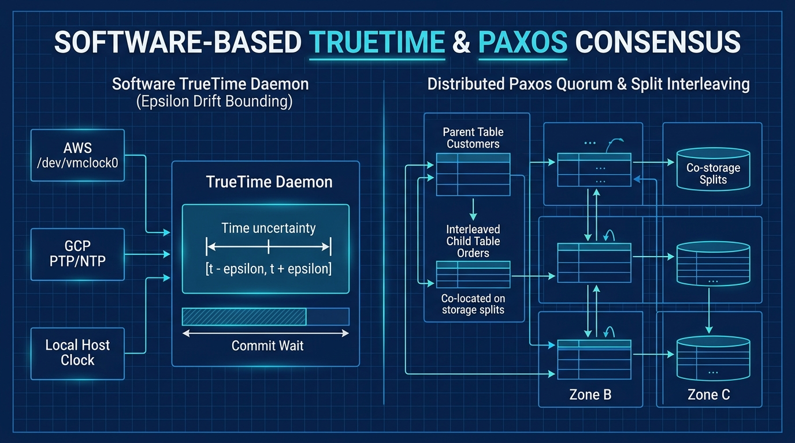
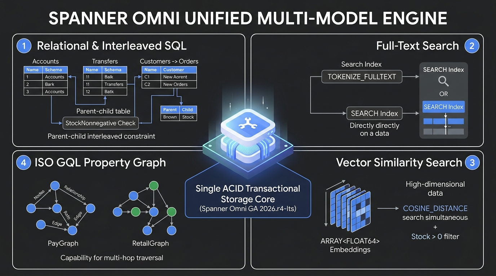
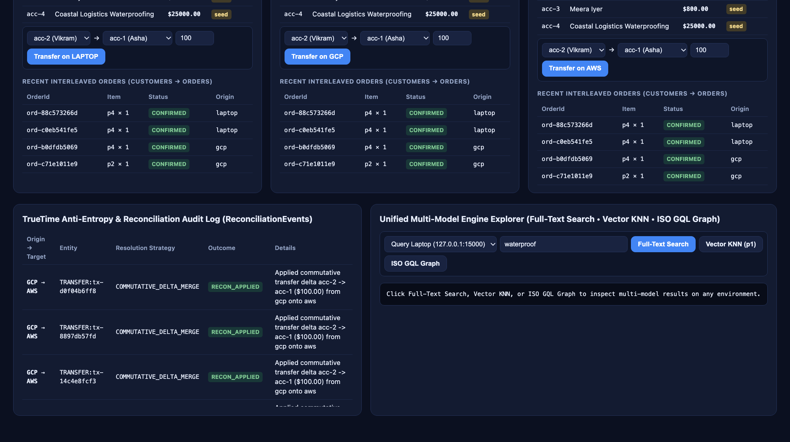
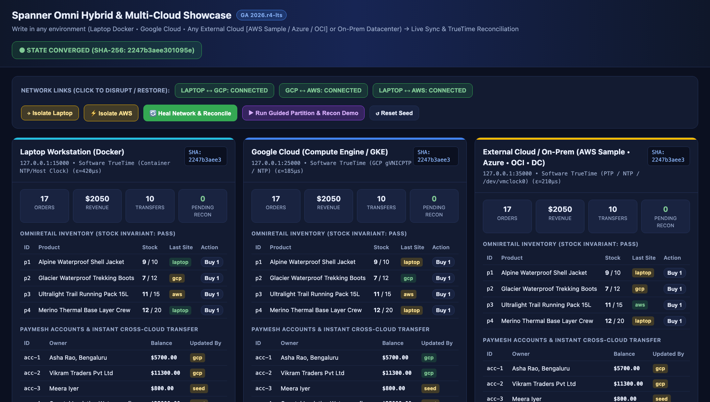
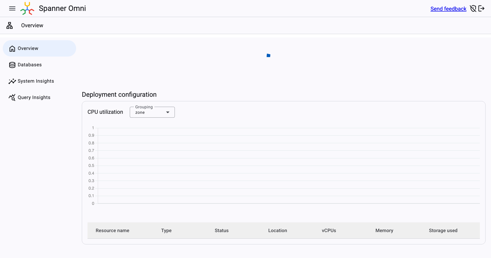
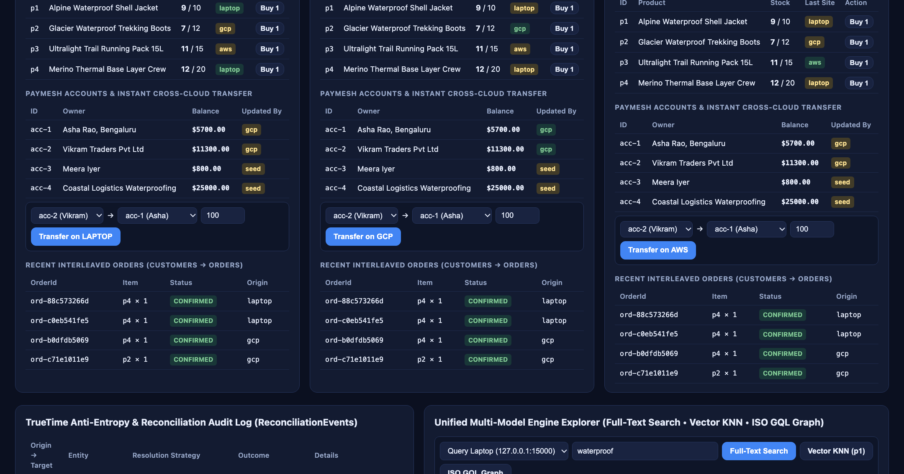
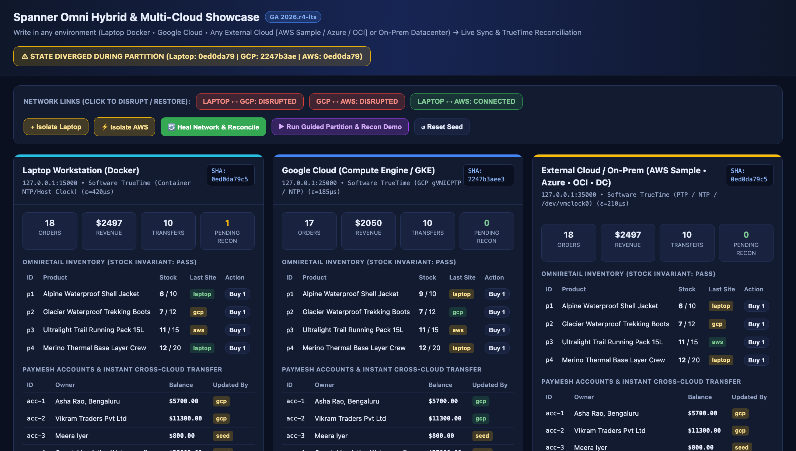
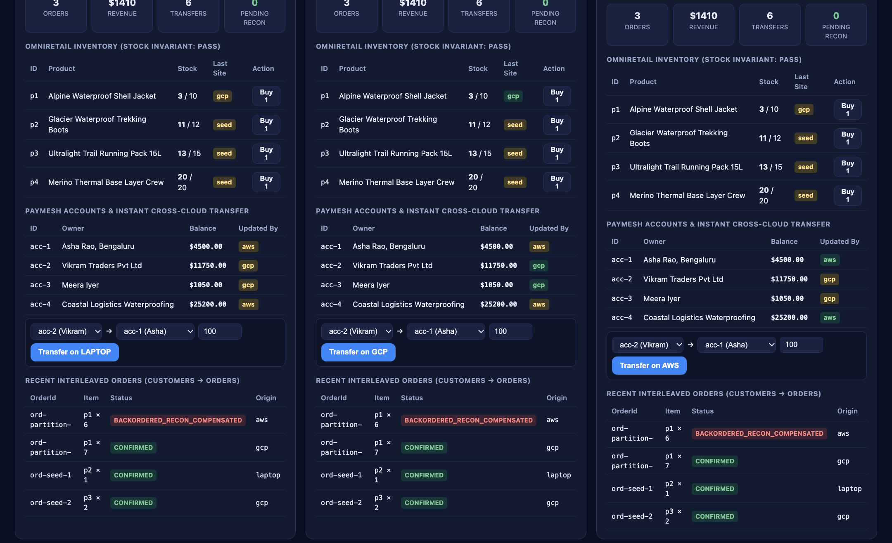

# Spanner Omni Everywhere: Building a True Hybrid & Multi-Cloud Database Mesh Across Google Cloud, External Clouds (AWS, Azure, OCI), On-Premises Datacenters, and Laptop Docker — With Live Sync & TrueTime Reconciliation

*How Google Cloud’s Spanner Omni (GA `2026.r4-lts`) breaks the hardware atomic-clock barrier to run anywhere—delivering self-managed multi-cloud portability alongside fully managed Cloud Spanner, and powering built-in AI vector search without external sync pipelines.*

> **Disclaimer**: This article and its companion repository represent a **personal project** built for architectural exploration, hybrid/multi-cloud testing, and hands-on learning. It is **not** an official Google Cloud publication or supported reference implementation. Refer to the **[Official Google Cloud Spanner Omni GA Launch Announcement](https://cloud.google.com/blog/products/databases/spanner-omni-deploy-anywhere-version-of-spanner-is-now-ga)**, the **[Official Google Cloud Spanner Omni Documentation](https://docs.cloud.google.com/spanner-omni/overview)**, and the **[Spanner Omni Release Notes](https://docs.cloud.google.com/spanner-omni/release-notes)** for authoritative product capabilities, system requirements, and licensing terms.


---

## Introduction: When Globally Consistent SQL Leaves the Datacenter

For over a decade, **Google Cloud Spanner** held a unique place in distributed systems engineering: it delivered **external consistency (strict serializability)** at global scale without sacrificing high availability. Yet there was a catch—traditional Cloud Spanner required Google’s proprietary datacenter hardware: rubidium atomic clocks and GPS receivers wired into every rack to bound clock uncertainty ($\epsilon$).

With the General Availability of **Spanner Omni (`2026.r4-lts`)**, Google has decoupled the core Spanner database engine from Google-owned hardware. Spanner Omni is the **deploy-anywhere, self-managed version of Spanner Omni**, designed to run on any cloud provider, on-premises datacenter, or workstation, while **Cloud Spanner** remains available as a **fully managed**, zero-ops database service natively on Google Cloud.

Because Spanner Omni ships as a self-contained OCI container image and Kubernetes Helm chart, you can now run the exact same battle-tested Spanner Omni engine—complete with **GoogleSQL**, **PostgreSQL (via PGAdapter)**, **Full-Text Search**, **Native AI Vector Similarity Search**, and **ISO GQL Property Graphs**—in **any environment**:

1. **A developer laptop** running a single Docker container (`127.0.0.1:15000`)
2. **Google Cloud** customer-managed Compute Engine VMs or GKE clusters (for sovereign, regulated, or isolated deployments where self-management is preferred over fully managed Cloud Spanner)
3. **Any external public cloud** — including **Microsoft Azure** (Azure VMs / AKS), **Oracle Cloud Infrastructure (OCI)** (OCI Compute / OKE), or **Amazon Web Services (AWS)** (EC2 / EKS)
4. **On-premises private datacenters, bare-metal servers, or disconnected edge sites**

In this hands-on architectural deep dive, we will build and run a self-contained **True Hybrid & Multi-Cloud Showcase (`PayMesh + OmniRetail`)** spanning **three environments** (a **Local Laptop Docker Container**, **Google Cloud**, and an **External Cloud / On-Premises Node**—using AWS in our sample provisioning script, though the exact same container and code work identically on Azure, Oracle Cloud, or an on-premises datacenter).

Most importantly, we will demonstrate the core capabilities every enterprise architect asks about:

- **True Hybrid and Multi-Cloud Portability**: Run the exact same Spanner Omni container image and schemas across multiple cloud providers and on-premises without cloud lock-in.
- **Self-Managed Flexibility vs. Fully Managed Zero-Ops**: Understanding how self-managed Spanner Omni on external infrastructure complements fully managed Cloud Spanner on Google Cloud.
- **Built-in AI & Multi-Model Engine**: Performing real-time semantic vector similarity search and graph traversal directly alongside transactional SQL without brittle CDC sync pipelines.
- **Live Cross-Environment Synchronization**: When a database record is updated in *any* environment, how is it immediately reflected across all other environments?
- **Network Disruption & Deterministic Reconciliation (`Recon`)**: When connections between environments are severed—and conflicting transactions occur independently during the outage—how does reconciliation happen without losing money or violating inventory invariants?

---

## 1. The Core Breakthrough: Software-Based TrueTime & Universal Portability

How can Spanner Omni guarantee external consistency on an external cloud VM, an on-premises bare-metal server, or a local workstation without a rubidium atomic clock?



### Bounding Clock Uncertainty ($\epsilon$) in Software Across Any Infrastructure

In traditional Cloud Spanner, TrueTime exposes an API `TT.now()` that returns a time interval $[t_{\text{earliest}}, t_{\text{latest}}]$ where $t_{\text{latest}} - t_{\text{earliest}} = 2\epsilon$. To guarantee external consistency, the transaction coordinator performs a **Commit Wait** of $2\epsilon$.

Spanner Omni replaces specialized rack hardware with a **Software-Based TrueTime daemon**:
- **Primary Time Server + Host Time Clients**: Omni continuously measures network round-trip times and bounds local quartz oscillator drift rate between synchronizations.
- **Universal Clock Adaptability Across Clouds & Datacenters**:
  - **On-Premises Datacenters / Bare-Metal**: Integrates with standard enterprise NTP (`chronyd`) or IEEE 1588 PTP hardware clocks (`ptp4l`).
  - **Microsoft Azure & Oracle Cloud (OCI)**: Leverages Hyper-V PTP (`/dev/ptp_hyperv`) or Stratum-1 NTP synchronization over dedicated block storage.
  - **AWS (used in our sample script)**: Binds to the Nitro hypervisor PTP clock device (`/dev/vmclock0` on `m7a.xlarge` with Amazon Linux 2023).
  - **Google Compute Engine**: Uses gVNIC precision time synchronization with a `TERMINATE` host-maintenance policy.
  - **Laptop Docker Container**: Uses the host kernel clock for zero-friction inner-loop development.

---

## 2. Spanner Omni Editions: Developer Edition vs. Commercial Edition vs. Managed Cloud Spanner

Spanner Omni ships with a built-in **Developer Edition** alongside the **Commercial Edition**. Understanding the key differences between these editions is essential when planning development, PoCs, and production deployments across clouds or datacenters:

| Capability / Licensing Dimension | Spanner Omni **Developer Edition** (Default in Container) | Spanner Omni **Commercial Edition** | **Managed Cloud Spanner** (GCP Service) |
| :--- | :--- | :--- | :--- |
| **Target Use Case** | Local developer inner-loop, CI/CD pipelines, functional PoCs, and architectural demos (non-production) | Mission-critical production workloads on Azure, OCI, AWS, On-Premises Datacenters, Sovereign GCP, or Edge | Cloud-native workloads on GCP wanting zero database ops & Google SLAs |
| **Licensing Model** | **Free** out of the box (optional free perpetual Developer key for extended multi-node dev) | **Annual per-vCPU subscription** (including worker vCPUs) or **paid 90-day PoC license** | Managed consumption pricing (nodes/processing units + storage) |
| **Single-Server ($\le 4$ vCPUs) Behavior** | **Never expires** (unlimited reads & writes) and **includes full Backup & Restore** without any license key | Never expires during active subscription | N/A (Managed continuous service) |
| **Multi-Server or $> 4$ vCPUs Behavior** | **90-day write limit** by default; after 90 days, writes are blocked and the database becomes **read-only** | Unlimited reads & writes across multi-zone, multi-cloud, and on-prem Paxos topologies | Elastic multi-region and regional scale |
| **Perpetual Developer Key Trade-off** | Installing the free perpetual Developer key removes the 90-day write limit for dev/test, **but disables Backup & Restore** | Full **Backup & Restore** enabled across all topologies (GCS, S3, or S3-compatible object stores) | Automated Managed Backups, PITR & Export |
| **Stateless ANN Vector Workers** | **Not available** (exact KNN via `COSINE_DISTANCE` works, but dedicated worker nodes on port `15027` are disabled) | **Available** (stateless workers build ANN vector indexes on tables $>1\text{M}$ rows up to **1 Billion vectors**) | Native high-scale vector indexing |
| **Multi-Model SQL, Search & Graph** | GoogleSQL, PostgreSQL (`PGAdapter`), Full-Text Search, and ISO GQL Property Graph | GoogleSQL, PostgreSQL (`PGAdapter`), Full-Text Search, and ISO GQL Property Graph | GoogleSQL, PostgreSQL, Search, Vector, Graph + BigQuery Data Boost |

---

## 3. One Engine, Four Data Models: No External Sync Pipelines

In most enterprise architectures, building an application that needs **ACID financial ledgers**, **full-text search**, **vector similarity recommendations**, and **graph relationship traversal** requires stitching together four separate databases (e.g., Postgres + Elasticsearch + Pinecone + Neo4j) with fragile CDC pipelines.

Spanner Omni executes all four workloads inside a **single ACID storage engine**:



In our showcase schema ([`schema.sql`](../schema.sql)), we combine:

1. **Native AI Vector Similarity Search Over Live Inventory**:
   Spanner Omni stores high-dimensional embeddings directly in table rows using `ARRAY<FLOAT64>`. Unlike standalone vector databases that require streaming changes via Kafka or Debezium, Spanner Omni performs real-time semantic similarity searches (`COSINE_DISTANCE(p.Embedding, r.Embedding)`) in the **exact same ACID transaction** as relational inventory checks:
   ```sql
   SELECT p.ProductId, p.Name, p.Stock, COSINE_DISTANCE(p.Embedding, @query_embedding) AS distance
   FROM Products p
   WHERE p.Stock > 0 AND COSINE_DISTANCE(p.Embedding, @query_embedding) < 0.45
   ORDER BY distance ASC
   LIMIT 5;
   ```
   This delivers a **Zero-CDC AI architecture**: your generative AI recommendation agents or search models query live transactional data with zero data staleness and guaranteed consistency. In Spanner Omni Commercial Edition, dedicated stateless ANN vector search workers scale this out up to **1 Billion vectors**.

2. **Graph-Augmented AI (GraphRAG) with ISO GQL Property Graphs**:
   Spanner Omni supports native property graphs (`PayGraph` and `RetailGraph`) queried with ISO GQL standard syntax. LLM agents can perform 3-hop payment reachability (`MATCH (a:Accounts)-[:Paid]->{1,3}(b:Accounts)`) and customer product graph traversals over relational tables without ETL pipelines or third-party graph databases.

3. **Transactional Full-Text Search**:
   Automatic `TOKENIZE_FULLTEXT` and `SEARCH` indexes are maintained transactionally alongside vector embeddings and relational columns for hybrid search (keyword + semantic similarity).

4. **Physical Table Interleaving (`Customers` $\rightarrow$ `Orders`)**:
   Child `Orders` rows are physically co-located on the same storage split as their parent `Customers` row (`INTERLEAVE IN PARENT Customers ON DELETE CASCADE`) for sub-millisecond parent-child joins.


*Figure: The OmniRetail catalog executing native vector similarity searches and order placement under physical stock check constraints directly within Spanner Omni.*

---

## 4. Zero-Pre-Provisioning Deployment Across Laptop, Google Cloud, and External Cloud / Datacenter

The exact same Python sample application ([`sample-app/app.py`](../sample-app/app.py)) connects to any Spanner Omni endpoint—whether it lives on your laptop, in Google Cloud, in Azure, in Oracle Cloud, in AWS, or in a private datacenter—using `InstanceType.OMNI` and `ClientOptions(api_endpoint=...)`:

```python
from google.api_core.client_options import ClientOptions
from google.cloud import spanner
from google.cloud.spanner_v1 import InstanceType

client = spanner.Client(
    client_options=ClientOptions(api_endpoint=ENDPOINT),
    instance_type=InstanceType.OMNI,
    use_plain_text=True,
)
database = client.instance("default").database("omni-hybrid")
```

To make testing completely self-contained, our repository includes zero-pre-provisioning scripts:
1. **Laptop Workstation (`127.0.0.1:15000`)**: `bash scripts/laptop-start.sh` pulls the GA container and launches a 4-vCPU single-server Developer Edition instance.
2. **Google Cloud (`127.0.0.1:25000` via SSH Tunnel)**: `bash scripts/gcp-create.sh` automatically creates a brand-new VPC, Subnet, Cloud Router/NAT, Firewall Rules, `100GB pd-ssd` disk, and `e2-standard-4` VM.
3. **External Cloud / On-Premises Node (`127.0.0.1:35000` via SSH Tunnel)**: In our sample code, `bash scripts/aws-create.sh` automatically provisions a new VPC, Internet Gateway, Subnet, Route Table, Security Group, SSH Key Pair, and EC2 instance. You can equally point `127.0.0.1:35000` to an SSH tunnel connected to an **Azure VM**, an **Oracle Cloud (OCI) instance**, or an **on-premises Linux server** running the exact same Spanner Omni container.


*Figure: Live multi-cloud mesh topology showing Laptop Workstation, Google Cloud (Compute Engine), and AWS (EC2) running in 100% cryptographic lockstep.*


*Figure: Google Spanner Omni's built-in web management console running on port 15026, showing databases, runtime status, and performance metrics.*

---

## 5. When Connections Break: How Cross-Environment Sync & Reconciliation (`Recon`) Work

Now let’s tackle the central architectural question:

> **How do we ensure that updating the database in any environment updates every other environment—and when connections are disrupted (e.g., an inter-cloud or datacenter WAN outage, or a laptop going offline), how does reconciliation happen when connectivity returns?**


### Our 4-Phase TrueTime Reconciliation Engine (`recon_engine.py`)

Naive "Last-Write-Wins" (LWW) overwrites balances and loses transactions during network splits. Instead, our showcase implements a **Transactional Outbox + TrueTime Anti-Entropy Reconciliation Engine**:

1. **Atomic Transactional Outbox (`SyncMutations`)**:
   Every business transaction (`execute_transfer` or `execute_checkout`) writes both the domain table update (`Accounts`/`Transfers` or `Products`/`Orders`) **and** a `SyncMutations` record inside the **same atomic Spanner Omni transaction** stamped with `COMMIT_TIMESTAMP`.
2. **Real-Time Propagation When Connected**:
   When network links between environments are healthy, committed mutations propagate immediately to all reachable peer environments, keeping their cryptographic `SHA-256` state digests identical.


*Figure: PayMesh financial ledger demonstrating cross-cloud funds transfer and instant outbox replication.*

3. **TrueTime-Ordered Replay & Commutative Delta Merging**:
   When a disrupted network link is healed, `reconcile_all()` exchanges `SiteSyncWatermarks`, collects all pending `SyncMutations`, and orders them globally by `(CommitTs, OriginSite, MutationId)`:
   - **Commutative Balance Deltas**: Concurrent debits on `acc-1` (`-$300` on the Laptop and `-$200` on the External Cloud node) are replayed as signed deltas rather than LWW overwrites, converging all environments to **`$4,500.00`**.
   - **Invariant-Preserving Stock Compensation**: When two partitioned environments concurrently sell 7 units and 6 units of `p1` (which only had 10 units in stock), the earlier TrueTime order is `CONFIRMED` (`Stock: 10 -> 3`), while the later conflicting order is automatically transitioned to `BACKORDERED_RECON_COMPENSATED` to preserve `CONSTRAINT StockNonnegative CHECK (Stock >= 0)`.


*Figure: Simulating a cloud network partition. Disconnected sites accept writes locally, entering temporary state divergence (`all_diverged: true`).*

4. **Cryptographic Convergence Verification (`SHA-256`)**:
   Computes a canonical `SHA-256` digest across all tables in every environment to verify 100% bit-for-bit convergence.


*Figure: The TrueTime anti-entropy engine resolves split-brain conflicts and merges commutative ledger deltas, restoring 100% SHA-256 state convergence across all clouds.*

---

## 6. Seeing It in Action: Self-Contained Sample App & Interactive Control Plane

Run the self-contained sample app walkthrough across all three environments in under two seconds:

```bash
python3 sample-app/init_db.py --all-sites
python3 sample-app/client_demo.py
```

Or launch the interactive **3-Environment Control Plane Web UI** on `http://127.0.0.1:8080`:

```bash
bash scripts/start-app.sh
```

---

## 7. Key Takeaways for Cloud & Enterprise Architects

1. **True Infrastructure Independence**: Whether your workload runs on Google Cloud, Microsoft Azure, Oracle Cloud, AWS, an on-premises datacenter, or a developer laptop, Spanner Omni provides the exact same SQL dialect, multi-model engine (Relational + Search + Vector + ISO GQL Graph), and client SDK (`InstanceType.OMNI`).
2. **Use Developer Edition Strategically**: Single-server deployments $\le 4$ vCPUs never expire and include full Backup & Restore for free; scale-out production clusters and high-scale ANN vector workers use the Commercial Edition.
3. **Design Explicitly for Network Partitions**: Pair multi-zone Paxos quorums with transactional outboxes (`SyncMutations`), commutative delta merging, and TrueTime invariant compensation for disconnected edge or cross-datacenter resilience.
